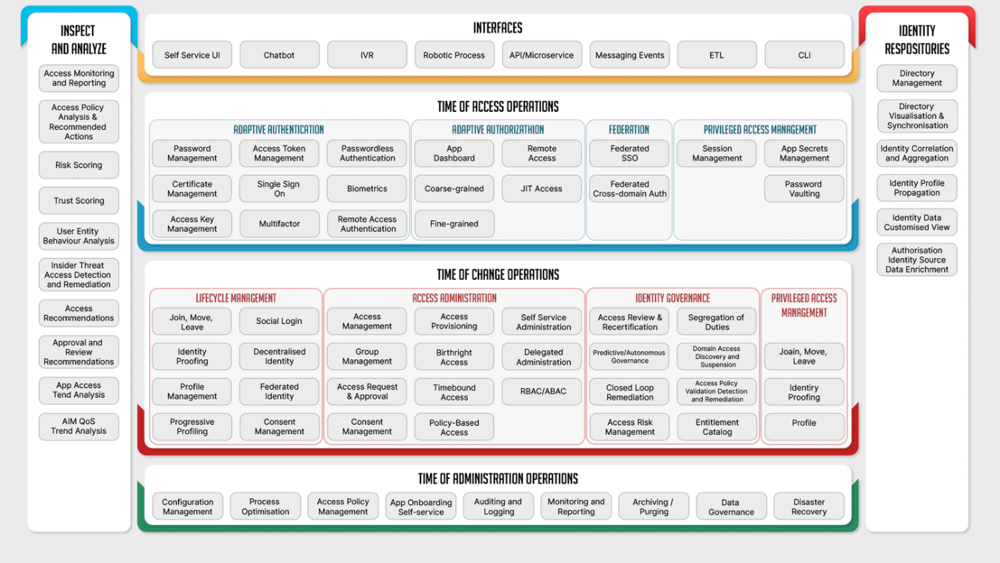
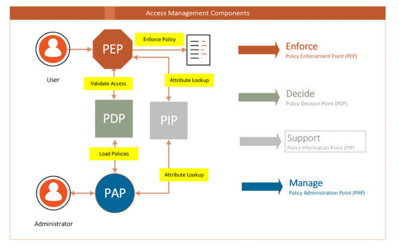
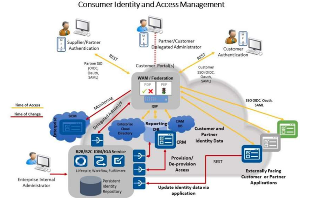
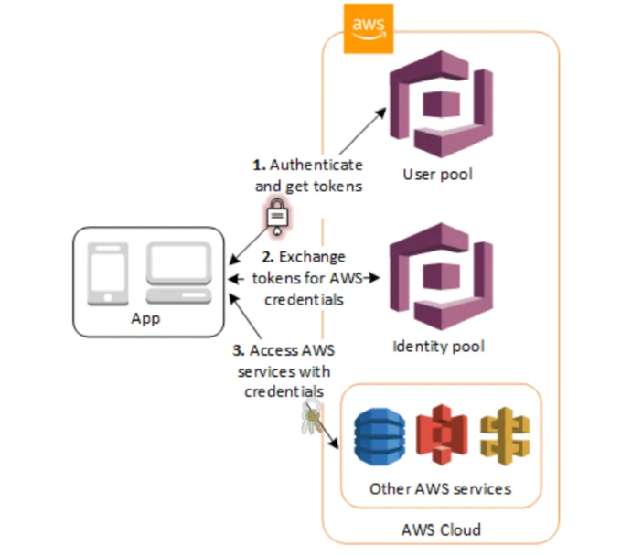

# Identity and Access Management (IAM)
1. Common protocols that handle Token Based Authentication are:
   1. **OAuth 2.0**, is the Authorization framework (what user is allowed to do), but not Authentication framework (proving who user is)
   2. **OpenId Connect (OIDC)**, adds critical identity layer that verifies user identity and confirms who the user is. \
       - Authentication is performed by authorization server, and also retrieves basic information about end user \
       - Uses OAuth 2.0 for Authorization.
2. Common Authentication patterns 
   - Passwords or One-time Passwords
   - Fingerprint Scan
   - Multi-Factor Authentication
3. Authorization is usually strongly coupled with access controls which define rules to access resources
   - ACL's (Access Control Lists)
   - RBAC (Role Based Access Control)
   - ABAC (Attribute Based Access Control)

# IAM Architecture elements/roles
1. **Database (Directory)**
   - IAM systems usually keep records of identities in their own data structures. 
   - Relational, Object, Graph databases can be used to store identity data.
   - **Hierarchical databases** are particularly suitable for handling identity storage. The tree data model makes them a good fit to store identity data.
   - Interactions with Hierarchical databases is done using LDAP protocol. 
   - Examples: **Active Directory, OpenLDAP** 
2. **Identity Management (IDM)**
   - IDM can be used to implement complex processes of how to aggregate, verify and merge user accounts from different systems (e.g, HR)
   - Controls user state such as expired or locked accounts. 
   - Implement approval processes for accounts and roles. 
   - Examples: **Midpoint, OpenIDM**
3. **Access Management (AM)**
   - Goal of Access Management is to allow the entitled actor to access the requested resource. 
   - AM systems include interconnected modules such as **Authentication, Authorization Control, Policy Management and Session Management.** 
4. **Identity Provider (IDP)**
   - Identity Provider is a trusted party that serves identity data. The data is typically shared in the form of secured assertions (e.g. cryptographically signed)
   - IDP typically performs authentication (password verification) and consent gathering.
   - Communication between IDP and its clients is usually implemented using one of identity protocols (SAML, OAuth2, OIDC)
   - Examples: 
     - OpenAM, Ping Identity (on-prem)
     - Okta, Auth0, AzureAD, Google Identity (cloud/IDPaaS)
5. **Relying Party (RP)**
   - RP is a party that uses identity data received from an IDP to identify the user and execute internal processes
   - RP and IDP have a trust relation i.e. RP believes that received data is correct
   - Example: Any application that uses federation, "Sign with Google"

## Functional Capabilities of IAM
   

## Authentication Factors
1. **Something you know**, most popular digital way to authenticate
   - This factor is based on human ability to remember and replay secrets.
   - Examples: **password, PIN, security question**
2. **Something you have**
   - Verification is accomplished via cryptographic algorithms (e.g. digital signatures)
   - Examples: **smart card, security token, certificate**
3. **Something you are**
   - People can be identified and authenticated by their biological structure.
   - These do not achieve perfect match (like crypto keys), Biometrics have certain False Acceptance and Rejection Rates
   - Biometrics are unique, if leaked cannot be changed, therefore storage raises legal concerns
   - Examples: **fingerprint scan, face scan, iris scan etc**
4. Common ways to verify person's identity:
   - **Knowledge based authentication (KBA)**, in form of security questions
   - **Single factor authentication**, in form of simple password check
   - **Multifactor authentication (MFA)**
   - **Re-authentication**, revalidate the identity of the user on sensitive action i.e. money transfer, password updates etc
   - **Step-up Authentication**, higher trust is required for sensitive action i.e. password is enough to login but SMS OTP is needed for bank transfers
   - **Continuous Authentication (Advanced Technique)**
     - Checks user's identity during whole session instead of only checking at login
     - A continuous authentication system constantly streams authentication data and calculates an identity verification score.
     - Uses behavioral biometrics, device data and context signals to monitor the user passively, and if behavior changes or is unsafe the system can block access or ask for Step-up Authentication
     - How it works?
       - Initial Login, The user logs in with standard credentials like password or fingerprint
       - Passive Monitoring, Sensors collect data in background without disturbing the user
       - Risk Scoring, A risk engine compares live actions to user's normal profile and updates trust score
       - Adaptive Response, if the score drops due to strange activity, the system limits access or triggers extra security checks
     - Key Signals Monitored:
       - **Behavioral Biometrics**, Keyboard typing speed, face recording
       - **Contextual Data**, Current Geo location, network IP address, Wi-Fi or mobile connections
       - **Device Characteristics**, Device health, browser activity
     - Benefits and Uses:
       - **Stops session Hijacking**, prevents attackers from taking over an active session if a user steps away from an unlocked computer
       - **Zero Trust Support**, fits tightly into modern Zero Trust security models where trust is never assumed permanently
       - **Better user experience**, reduces the need for disruptive, repeated password prompts by working quietly in background
   - **Context based and risk based authentication**, similar to Continuous Authentication but differs in timing and scope
     - Operates strictly at specific moment of a login or access request
     - Calculates risk score based on environment variables before granting entry
     - Signals, static or point in time context like geo location, IP reputation, device fingerprint, time of day etc

## Access management
1. **Role Based Access Control (RBAC)**
    - Access to resources is based on roles to which users are assigned. Very similar to AWS IAM roles and policies
    - Key adv of RBAC is ease of administration, edits or changes to a role can update permissions to thousands of users.
    - Highly customizable with Deny, Conditions etc. on resources
2. **Attribute Based Access Control (ABAC)**
    - RBAC model focuses on roles, it's a special case of ABAC model which only uses attributes of a role.
    - ABAC avoids the need for capabilities (operation/object pairs) to be directly assigned to subject requesters or to their roles or groups before the request is made.
    - How this works? Subject requests access, the ABAC engine can make an access control decision based on assigned attributes of the requester, the assigned attributes of the object, env conditions and set of policies that are specified in terms of those attributes and conditions.
3. **ReBAC (Relationship based Access Control)** & **Artificial Intelligence Supported Access Control (AIAC)**
    - ReBAC model leverages the relationship between the access requester and other identities who can potentially be affected by access control decision.
    - ReBAC relies on availability of large, distinct data sets (incorporated data from HR & Access/entitlement/behavior)
    - Processing large data sets and making rapid decisions is a perfect application for AI, hence latest advancements in access mgmt involve AIAC.

> [!CAUTION]
> 1. Read up on **SRP protocol (Secure Remote Password)**

## Advanced Customer Identity and Access management (CIAM) Architecture
The center of system is Identity Provider (IDP) which provides authentication functionality for various clients \
It also serves externally facing applications via federation protocols \
Behind IDP, databases, monitoring and IDM (Identity Management) elements are present \
The architecture also has CRM (Customer Relationship Management) system, which is used to manage access. \
IDM with IGA (Identity Governance & Administration) plays the role of single source of truth that aggregates data (via connectors) and allows centralised administration.

## Amazon Cognito Case Study
   - Provides Authentication, Authorization and User Management
   - It is a Customer Identity and Access Management (CIAM) service. 
   - It acts as an **Identity provider (IDP)** and **Identity broker** to handle **user registration, authentication (login/signup) and authorization** for mobile and web applications.

Cognito handles identity management through two main components:
   - **User Pools** are user directories that provide sign-up and sign-in options for all users.
     - Facilitates users to sign in to application via Amazon Cognito or federate through third-party identity providers like Apple, Google, Facebook etc
     - User pool have a directory profile that can be accessed via an SDK to manage pools programmatically
   - Identity Pools, provides functionality to grant users access to other AWS services.
     - Users can obtain temporary AWS credentials to access AWS services, S3, Dynamo etc. 
     - Identity pools can be used without User Pools to support anonymous guest users

## Okta integration with Cognito

This architecture means Okta acts as the "master" login source, but your AWS applications still talk directly to Cognito. Instead of switching from Cognito to Okta, you configure Okta as a trusted login provider (Identity Provider) inside Cognito. Your app authenticates with Okta, and Cognito then creates the local session.

### How the Workflow Functions

1. **User Login:** When users try to log in, they are redirected to Okta to enter their credentials.
2. **Verification:** Okta authenticates the user and verifies their identity.
3. **Federation:** Okta passes a security token confirming the user's identity to Cognito.
4. **Token Minting:** Cognito accepts this trusted Okta token and issues its own Cognito JWT (JSON Web Token) for your app's frontend.

### Why Do This?

* **Centralized Management:** It lets employees or customers use their existing corporate Okta credentials to log into applications built on AWS.
* **Keeps AWS Integrations Intact:** Your AWS services (like API Gateway or AppSync) rely on Cognito tokens for permissions and access control. By federating, you get Okta's login features without breaking your backend AWS infrastructure.

# Secure design principles

